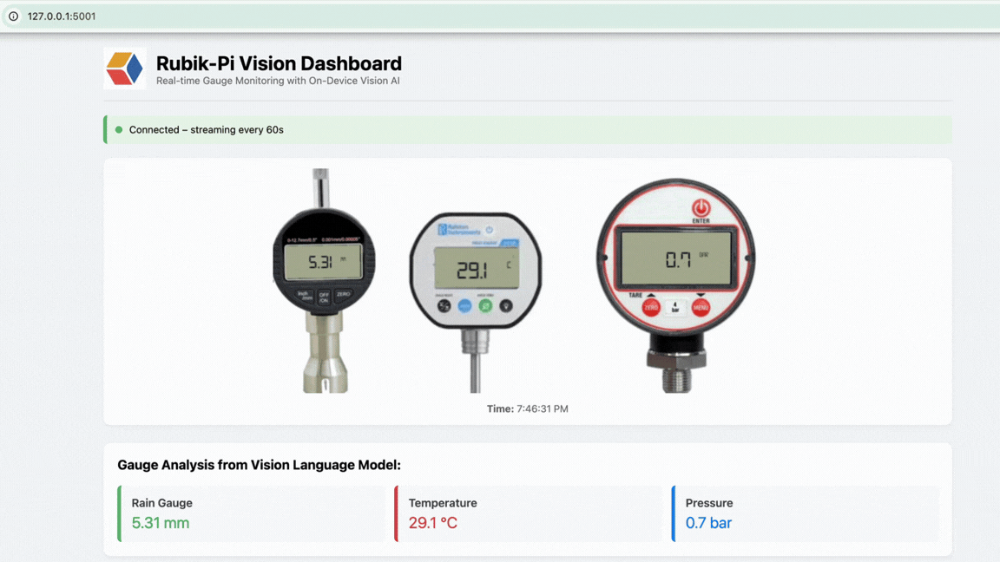

# Visual Language Model on Rubik-Pi



## 0. Install Llama.cpp

Make sure you have installed llama.cpp on Rubik-Pi using this guide - [Link](https://www.thundercomm.com/rubik-pi-3/en/docs/rubik-pi-3-user-manual/1.0.0-u/Application%20Development%20and%20Execution%20Guide/Framework-Driven%20AI%20Sample%20Execution/llama_cpp/)

## 1. Create a Python Virtual Environment

Create and activate a virtual environment:

```bash
python3 -m venv vlmenv
source vlmenv/bin/activate
```

## 2. Install Dependencies

Install the required Python packages:

  ```
  pip install -r requirements.txt 
  ```

## 3. Download the Model

Download the required model from Hugging Face (replace with the correct repository):

- LFM2 Model

  ```
  hf download LiquidAI/LFM2-VL-1.6B-GGUF LFM2-VL-1.6B-Q4_0.gguf  --local-dir .
  hf download LiquidAI/LFM2-VL-1.6B-GGUF mmproj-LFM2-VL-1.6B-F16.gguf --local-dir .
  ```

- LFM2.5 Model

  ```
  hf download LiquidAI/LFM2.5-VL-1.6B-GGUF LFM2.5-VL-1.6B-Q4_0.gguf  --local-dir .
  hf download LiquidAI/LFM2.5-VL-1.6B-GGUF mmproj-LFM2.5-VL-1.6b-F16.gguf --local-dir .
  ```

## 4. Start the Inference Engine

Launch the llama.cpp inference server:

  ```
./start_llama.cpp
  ```

Make sure the script has execution permission:

  ```
chmod +x start_llama.cpp
  ```

## 5. Start the Application

  ```
  python3 app.py
  ```

## Metrics

| Metric        | Reading   |
|---------------|-----------|
| Prompt speed  | ~19 tok/s |
| Generation    | ~6 tok/s  |
| Image encode  | ~21 s     |
| Total time    | ~31.6 s   |
